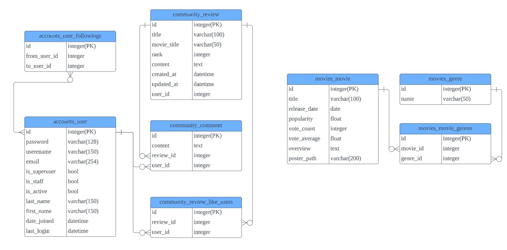
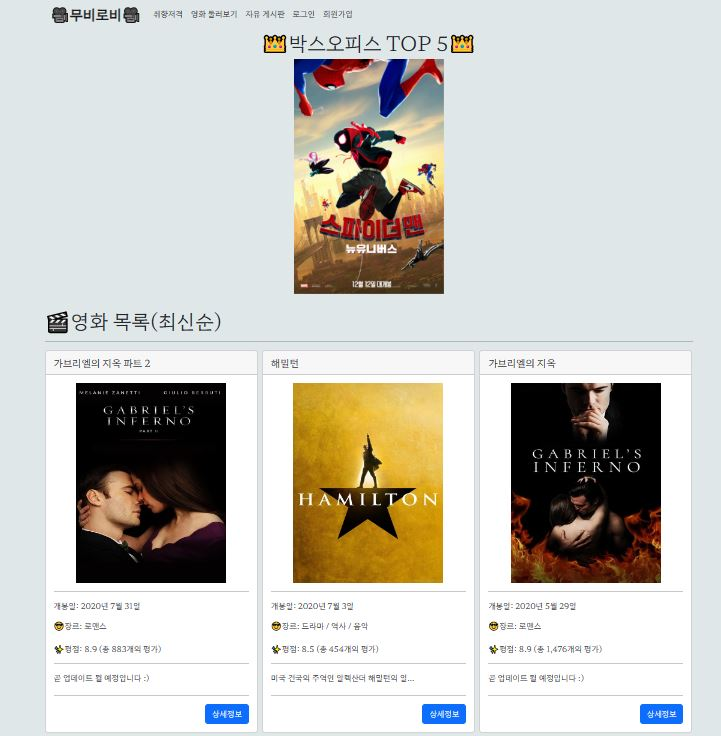
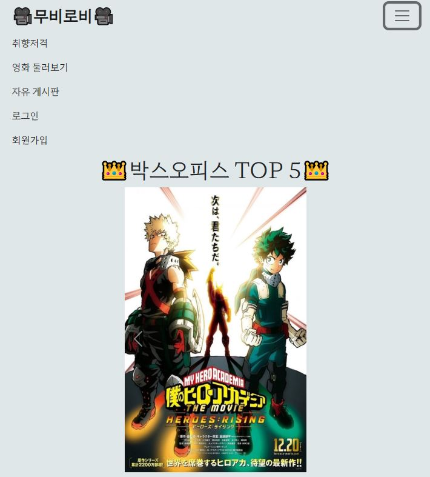
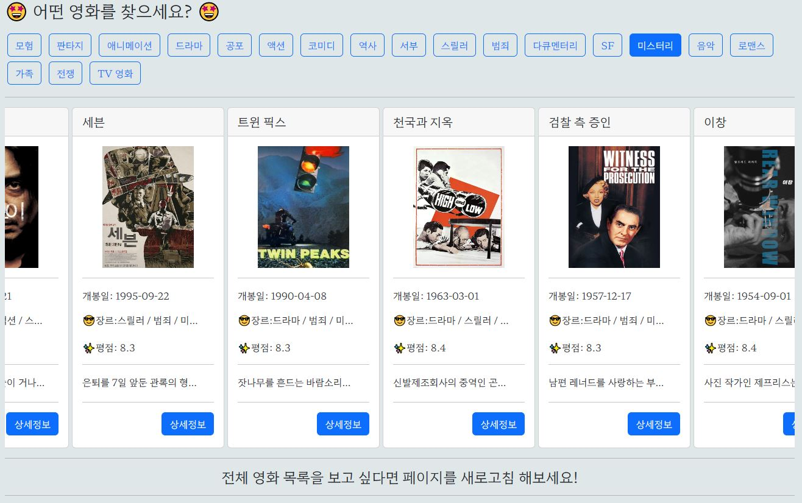
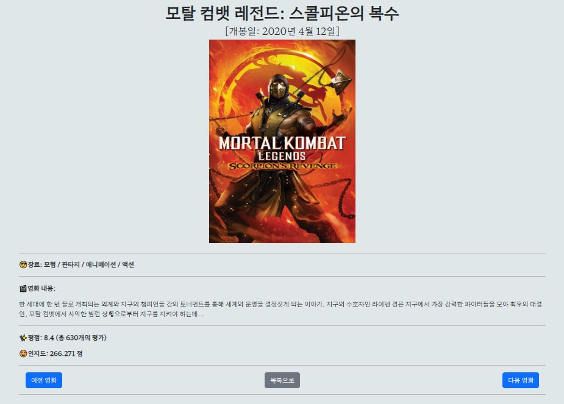
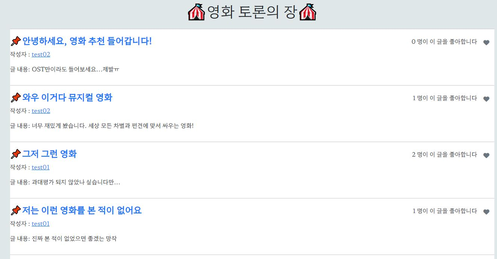
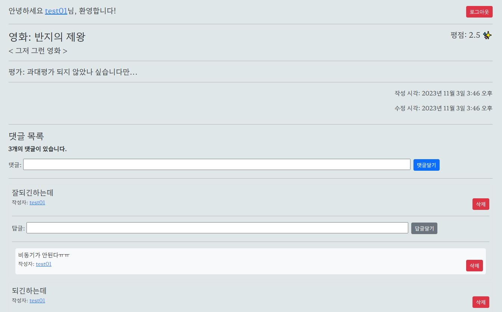
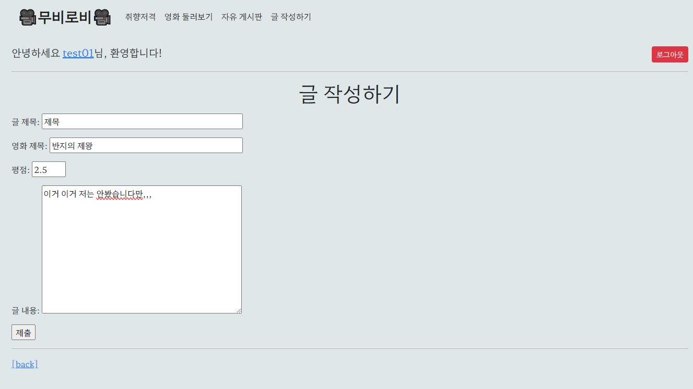
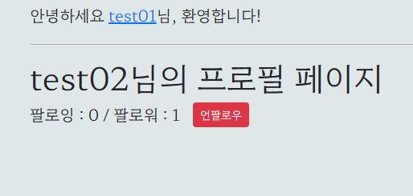

# Movie-Community [개인프로젝트]

## 목차
- [Movie-Community \[개인프로젝트\]](#movie-community-개인프로젝트)
  - [목차](#목차)
  - [개요](#개요)
  - [개발환경](#개발환경)
  - [API](#api)
  - [데이터베이스 모델링(ERD)](#데이터베이스-모델링erd)
  - [서비스 차별점](#서비스-차별점)
  - [페이지별 안내](#페이지별-안내)
  - [문제 및 해결](#문제-및-해결)
  - [실패 및 분석](#실패-및-분석)

## 개요
- 비동기 통신을 활용한 스크립트 기능
- AJAX 통신과 JSON 구조에 대한 이해
- 영화 추천 알고리즘 설계
- 커뮤니티 서비스 구성
- Bootstrap을 활용한 웹 사이트 디자인

## 개발환경

## API
- 영화 데이터: TMDB API

## 데이터베이스 모델링(ERD)

## 서비스 차별점
1. TOP 버튼을 Fixed 포지션으로 우측 하단에 고정, 클릭 시 비동기 통신을 통해 페이지 최상단으로 이동
2. Carousel과 Auto Play 기능을 통한 실시간 TOP 5 영화 노출 및 상세 페이지 연결
3. Radio 버튼과 change 이벤트를 통한 장르별 영화 분류
4. 분류별 영화 노출 시 Horizontal 스크롤을 통한 영화 카드 가독성 확보

## 페이지별 안내
- 메인 페이지: 박스오피스 TOP 5 및 영화 목록(최신순)

- 반응형 웹 디자인: 디스플레이 크기에 따라 재구성

- 카테고리별 영화: 장르별 영화 카드 형식으로 목록 확인

- 영화 상세 페이지: 영화 제목, 개봉일, 장르, 내용, 평점, 평가수, 인지도

- 게시판 목록: 게시글 및 좋아요 기능

- 게시판 상세 페이지: 영화 제목, 평점 및 글 내용, 작성/수정 시각, 좋아요, 댓글, 답글 기능

- 게시글 작성 페이지: 영화 및 글 내용 작성

- 프로필 페이지: 팔로우 및 팔로워 확인 기능

## 문제 및 해결
1. 영화 정렬: Movie.objects.all()로 데이터를 불러온 뒤에 .order_by를 활용하여 정렬 기준을 설정하여 배열 작성
2. 형식 변경(숫자 콤마): humanize필터와 |intcomma를 활용하여 세 자리마다 콤마 입력
3. 이전, 다음 영화 이동: pk를 필터링하여 prv_movie_pk와 nxt_movie_pk변수를 설정, 이동 기능 구현
4. 장르명 출력: 장르 테이블에 장르 정보(숫자)를 대입, for문을 활용하여 장르명 출력
5. 답글: 댓글을 self 외래키로 참조하여 comment 테이블에 papa_comment라는 column을 추가하고, soncomment라는 변수를 설정하여 댓글과 답글 구분 및 확인

## 실패 및 분석
- 답글 작성 비동기 구현: 답글 작성 POST 요청 시 csrf_token을 활용하기 위해선 해당 token을 정확히 인식하고 불러와야 하는데 댓글과 답글 모두 한 테이블에서 for문 처리로 불러오다보니까 정확한 token 값을 가져와서 POST 요청 하는 것이 불가능함. 설계 과정에서 테이블을 나누는 방법을 고려했어야 함.